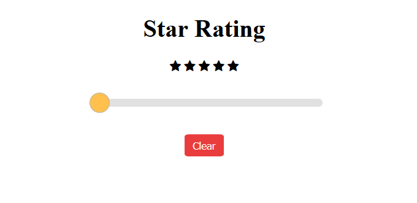

# Star Rating
Implement **Star Rating** on your website with ease. 

## Getting Started

The code is provided in simple HTML, CSS, and JS which makes it easy to implement **Star Rating** on your website without using any library, framework, etc.

From your command line, clone and run Star Rating:

```bash
# Clone this repository
$ git clone https://github.com/PulkitBanta/StarRating.git

# Run locally in your browser
Open index.html or run a live server from VS code
```

## How to use

* Give rating with the slider.
* Select rating by simply clicking on the star.
* Click on `Clear` to clear the rating

## Screenshots



## Built With

* HTML
* CSS
* JS

## Contributing

Currently not accepting any contributions.

## Authors

* **Pulkit Banta** - *Initial work*, *Designing*, *Code* - [PulkitBanta](https://github.com/PulkitBanta/)